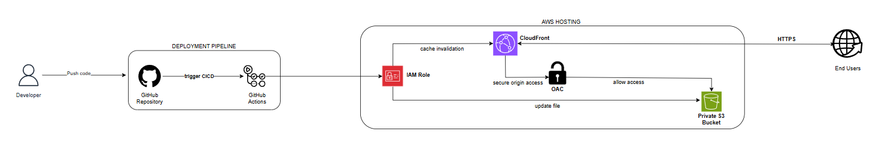

# React App S3 + CloudFront Deploy

**Live site:** https://d1uzz6njie6b8j.cloudfront.net/

A React app deployed to AWS via GitHub Actions.

## Architecture Diagram



## Getting Started

```bash
npm install
npm run dev
npm run build
```

## Deployment

Pushes to the `main` branch automatically trigger the GitHub Actions workflow:

1. Installs project dependencies
2. Builds the React app
3. Uploads files to AWS S3
4. Refreshes CloudFront so the latest version is shown

### Required GitHub Secrets

| Secret | Description |
|---|---|
| `AWS_ACCESS_KEY_ID` | IAM user access key |
| `AWS_SECRET_ACCESS_KEY` | IAM user secret key |
| `AWS_REGION` | AWS region |
| `S3_BUCKET` | S3 bucket name |
| `CLOUDFRONT_DIST_ID` | CloudFront distribution ID |
